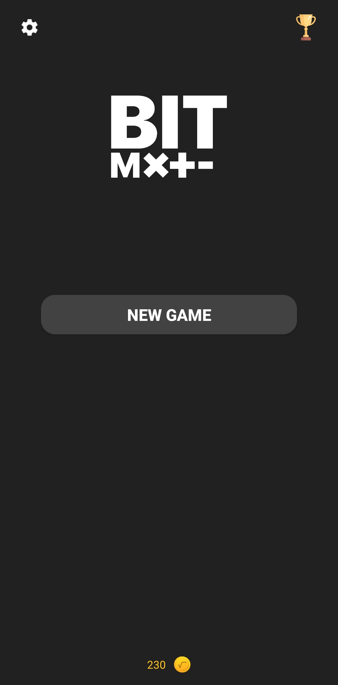
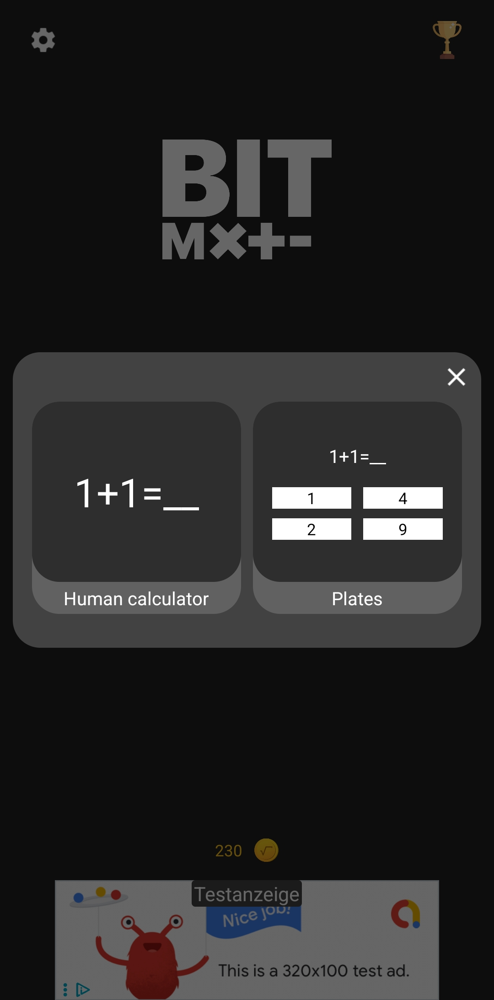
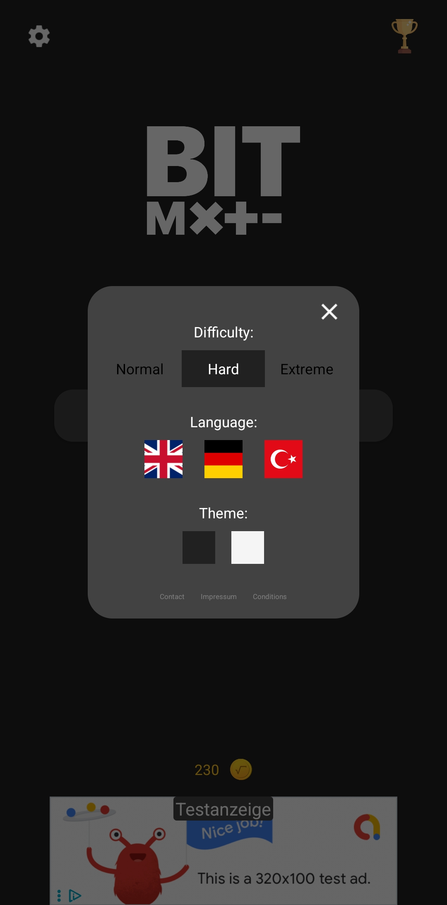

# BitMath

BitMath is a simple mobile app designed to help users practice basic math operations under time pressure. The app offers two game types, three difficulty levels, a coin system and a multilingual interface in German, English and Turkish. A highscore system is included but still under development.

## Features

• Two game modes  
   Mode 1. Enter the correct result manually  
   Mode 2. Choose the correct result from four options  

• Three difficulty levels  
   Easy  
   Medium  
   Hard  

• Multilingual interface  
   German  
   English  
   Turkish  

• Coin system  
   Coins are awarded for correct answers  
   Rewards and shop features are in development  

• Highscore system  
   Display soon available  

• Clean and simple UI  

## Screenshots

  
  
  
  
  

## Download

You can download the latest APK here.

[Download BitMath APK](https://github.com/erdikara-git/BitMath/releases/download/VERSION/DATEINAME.apk)

Replace VERSION and DATEINAME with the values from your release.

## How it works

BitMath generates random math tasks. Depending on the selected mode you either enter the result or choose the correct one from the list. The timer increases the challenge and rewards accuracy under pressure.

## Technologies

• Android  
• Java  
• Sketchware based project structure

## Status

The app is under active development. More features and UI improvements will follow.

